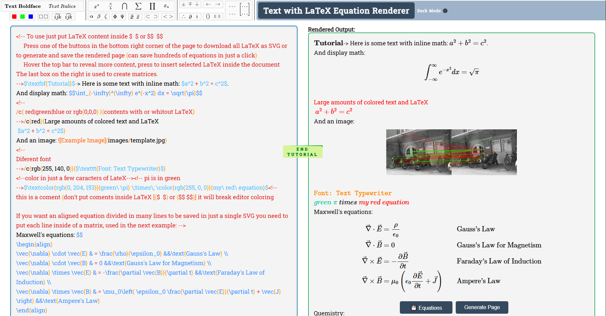
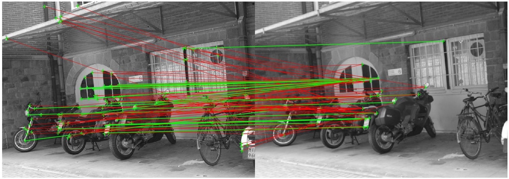

<p align="center">


</p>
<p align="center">


</p>


***

# 🧮 LaTeX Equation Render Tutorial

Welcome to **LaTeX Equation Render** — an interactive page created to learn, visualize and export mathematical expressions in **LaTeX** in a simple and fast way! 🚀  

This project was developed as a didactic tool where the user can **write, color and manipulate** LaTeX content and **export everything (LaTeX) to SVG** with just one click! 🎨📄 (you can export hundreds of equations with just 1 click!!!)  

You can also generate pages and save them as an **.html** file.

[Click Here to Test it !!!](https://0xtorres.github.io/LaTeX-Equation-Render/)

***

## 📸 Screenshot

<p align="center">

</p>


***

## ✨ Main Features

✅ **Instant rendering** of LaTeX expressions (inline and display).  
✅ **Easy export** of all equations as SVG.  
✅ **Quick insertion** of symbols and matrices with a single click.  
✅ **Colored and styled text** (useful for tutorials and presentations).  
✅ **Support for mathematical and physical equations**.  
✅ **Support for chemical equations** with the [mchem](https://mhchem.github.io/MathJax-mhchem/) package.

***

## 🧭 How to Use

1. **Insert your LaTeX content** between `$...$` (inline) or `$$...$$` (display).  
2. **Use the buttons in the bottom‑right corner** to:  
   - 💾 Preview and save all formulas as SVG.  
   - 🧩 Generate and save the rendered page.  
3. **Hover the mouse over the top bar** to reveal extra tools.  
4. **Use the last block on the right** to easily create **matrices**.

***

## 🧠 Example Usage

### 🔹 Inline Math

```latex
$a^2 + b^2 = c^2$
```

Result: </span>

### 🔹 Display Math

```latex
$$\int_{-\infty}^{\infty} e^{-x^2} dx = \sqrt{\pi}$$
```

Result:  
</span>

### 🔹 Colored Text

```latex
/c{red}{Texto em vermelho com LaTeX: $a^2 + b^2 = c^2$}
```

Result:  
<span style="color:red">
Texto em vermelho com LaTeX:
</span>

### 🔹 Different Fonts with Colors

```latex
/c{rgb(255, 140, 0)}{$\texttt{Font: Text Typewriter}$}
```
Result:  
</span>

### 🔹 Physics Equations

Maxwell’s Equations:

```latex
\begin{align}
\vec{\nabla} \cdot \vec{E} & = \frac{\rho}{\epsilon_0} &&\text{Gauss's Law} \\
\vec{\nabla} \cdot \vec{B} & = 0 &&\text{Gauss's Law for Magnetism} \\
\vec{\nabla} \times \vec{E} & = -\frac{\partial \vec{B}}{\partial t} &&\text{Faraday's Law} \\
\vec{\nabla} \times \vec{B} & = \mu_0\left( \epsilon_0 \frac{\partial \vec{E}}{\partial t} + \vec{J} \right) &&\text{Ampere's Law}
\end{align}
```
Result: 

</span>

### 🔹 Chemistry 🧪

```latex
\ce{K = \frac{[\ce{Hg^2+}][\ce{Hg}]}{[\ce{Hg2^2+}]}}
```
Result: 

</span>

```latex
\ce{Zn^2+ <=>[+ 2OH-][+ 2H+] \underset{\text{amphoteres Hydroxid}}{\ce{Zn(OH)2 v}} <=>[+ 2OH-][+ 2H+] \underset{\text{Hydroxozikat}}{\ce{[Zn(OH)4]^2-}}}
```
Result: 

</span>

##### 🔐 Documentation and Tutorial: [mchem](https://mhchem.github.io/MathJax-mhchem/) 🔐

***

## 📸 Image Example

```markdown

```

<p align="center">

</p>


***

## ⚙️ Technologies Used

- 🧩 **HTML / CSS / JavaScript / Regex**  
- ✍️ **MathJax**  
- 🎨 **Custom Syntax Highlighting**  
- 🔬 **[mchem](https://mhchem.github.io/MathJax-mhchem/) (MathJax package for chemistry)**  

***

## 💡 Tip

> 💬 **Avoid putting comments inside LaTeX delimiters** (`$...$` or `$$...$$`) — this can break the coloring and rendering!  

> 🌛 Click on **Dark Mode ⚫️** (top‑right corner) to change the page theme!  

> 📝 Click on **End Tutorial** (center of the page) to erase the tutorial content and start using it right away 🤓  

***

## 📜 License

Distributed under the **GPLv3** license.

***

### 🔹 Dependencies

- **[MathJax](https://cdn.jsdelivr.net/npm/mathjax@3/es5/tex-mml-chtml.js)** (math rendering): Apache License 2.0

```html
<script src="https://cdn.jsdelivr.net/npm/mathjax@3/es5/tex-mml-chtml.js"></script>
```

- **[mark.js](https://cdn.jsdelivr.net/npm/mark.js/dist/mark.min.js)** (text highlighting): MIT License

```html
<script src="https://cdn.jsdelivr.net/npm/mark.js/dist/mark.min.js"></script>
```

- **[JSZip](https://cdnjs.cloudflare.com/ajax/libs/jszip/3.10.1/jszip.min.js)** (ZIP compression): MIT License

```html
<script src="https://cdnjs.cloudflare.com/ajax/libs/jszip/3.10.1/jszip.min.js"></script>
```

- **[Roboto Slab](https://fonts.googleapis.com/css2?family=Roboto+Slab&display=swap)** (font family): Google Fonts license (SIL Open Font License)

```css
@import url('https://fonts.googleapis.com/css2?family=Roboto+Slab&display=swap');
```

All licenses are compatible with **GPLv3**.

***

### 🧑‍💻 Author

Developed with 💖 by **Carlos Torres**.
